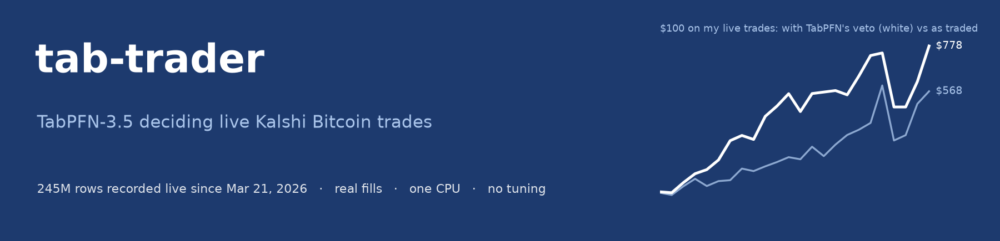
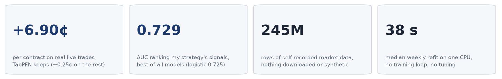
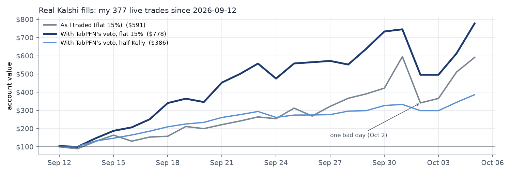
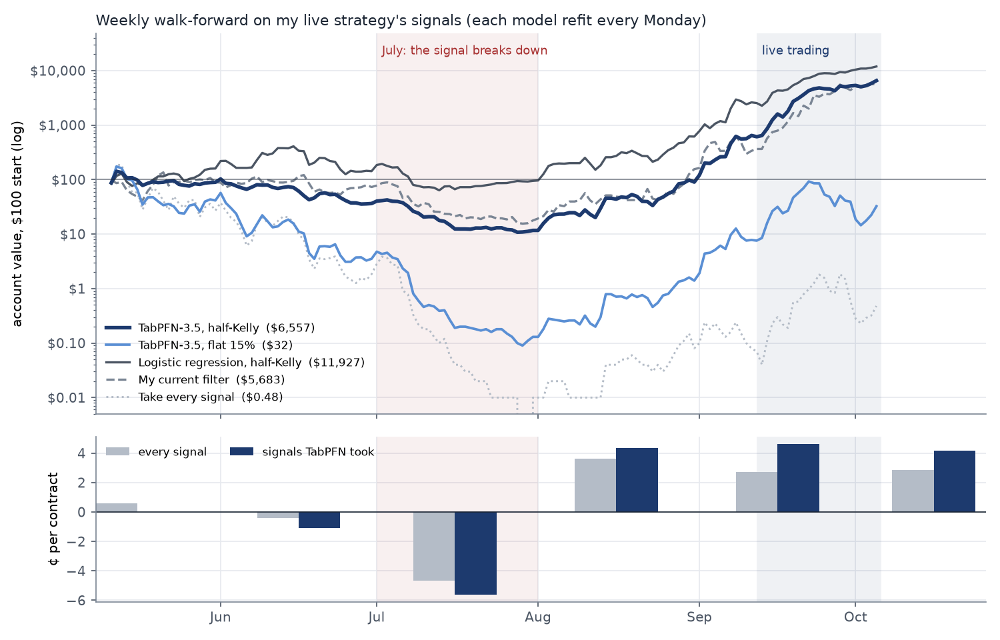

<p align="center"></p>

<p align="center">


</p>

# tab-trader

**TabPFN-3.5 deciding which Kalshi 15-minute Bitcoin trades to take, on real, messy, self-recorded market data.**
One CPU, no training loop, no hyper-parameter tuning.

<p align="center"></p>

**[Open the interactive report](https://htmlpreview.github.io/?https://github.com/Cloblak/tab-trader/blob/main/docs/index.html)**
· [notebooks](notebooks/) · [data card](data/DATA_CARD.md) · [test plan](PREREG.md)

<!-- DATA:START -->
## Why this is a real test

Nothing here is a benchmark download. Every row was recorded by my own collectors while the markets traded, and my strategy trades on it with real money.

- **Real.** 245 million rows since 2026-03-21: quotes four times a second, the full order book, spot prices from four exchanges and the settlement index. Kalshi keeps only about two months of history, so most of this exists nowhere else. Since 2026-09-12 the strategy has traded it with real money: 376 trades with real fills and fees.
- **Messy.** Before a collector rewrite on 30 July only 60% of quotes were clean, and 3% of rows showed impossible crossed books (after it: 96% clean, none crossed). In July only 16% of the hourly ladder's recorded quotes matched the exchange's own records. There are outages, stale quotes and a regime change mid-sample. Every price used here is checked against Kalshi's candles.
- **Small and noisy.** My strategy produced 2,871 usable signals in five months, and only a few hundred per regime. Signals win about 77% of the time and the market price alone already ranks them at AUC 0.727, so there is little left for any model to find.
- **Honest labels, fast.** Every contract settles at $1 or $0 within 15 minutes, so every prediction is scored against reality, and the market price is a strong baseline to beat.

> [!TIP]
> **Small, noisy, drifting tables with a hard baseline are the setting TabPFN was built for.** No synthetic data, no cleaned-up competition set.

<!-- DATA:END -->

<!-- RESULTS:START -->
## What TabPFN does well here

> [!IMPORTANT]
> **On 376 real live trades, the ones TabPFN would have kept earned +6.90¢ per contract. The ones it would have skipped earned +0.25¢.** Same signals, same fills, same fees: TabPFN's probability alone separated the trades that paid from the ones that did not.

- **It ranks my live strategy's signals best.** In a weekly walk-forward (22 weeks, 2,871 signals, each week refit on the previous 12), TabPFN-3.5 separates winners from losers with AUC 0.729, against 0.725 for logistic regression and 0.688 for LightGBM. No tuning.
- **Its veto works on real fills.** On my 376 actual live trades since 2026-09-12, the trades TabPFN would have kept (166) earned +6.90¢ per contract; the 210 it would have skipped earned +0.25¢. At 15% per trade, $100 ends at $777.72 with its veto against $568.49 as I traded.



- **It is at or near the top on public data.** With generic indicators that anyone can rerun from this repo (15-minute up/down: TabPFN-3.5 ranks #2 of 8 on prediction error and is significantly better than 5 of 6 tuned classic models; hourly strike ladder: TabPFN-3.5 ranks #1 of 8 on prediction error and is significantly better than 1 of 6 tuned classic models). No model beats the market price itself on prediction error.

## The full walk-forward

Weekly walk-forward on my live strategy's signals, 2026-05-11 to 2026-10-05. Every Monday each model is refit on the previous 12 weeks and takes a signal only if its probability beats the price plus the fee. The rules were fixed before the run ([`PREREG.md`](PREREG.md), amendment 3). $100 to start; each trade stakes 15% of the balance (or half-Kelly), never more than 500 contracts.

| Trade filter | $100 becomes | Sharpe | Max drawdown | Trades | ¢ per contract [95% range] |
|---|---|---|---|---|---|
| Logistic regression, half-Kelly | $11,926.55 | 5.24 | -84.5% | 1658 | +1.92 [+0.25, +3.55] |
| **TabPFN-3.5**, half-Kelly | $6,557.03 | 4.59 | -92.4% | 1581 | +1.63 [+0.01, +3.19] |
| My current filter (frozen), flat 15% | $5,683.15 | 4.27 | -88.5% | 1591 | +1.87 [+0.44, +3.37] |
| Logistic regression, flat 15% | $536.97 | 3.31 | -99.7% | 1658 | +1.92 [+0.25, +3.55] |
| LightGBM, half-Kelly | $128.79 | 2.6 | -99.8% | 2257 | +1.01 [-0.35, +2.27] |
| **TabPFN-3.5**, flat 15% | $32.50 | 2.19 | -99.9% | 1581 | +1.63 [+0.01, +3.19] |
| LightGBM, flat 15% | $8.12 | 1.84 | -100.0% | 2257 | +1.01 [-0.35, +2.27] |
| Take every signal, flat 15% | $0.48 | 1.98 | -100.0% | 2871 | +0.80 [-0.49, +2.06] |

> [!NOTE]
> Logistic regression, half-Kelly ends 1.8× higher than TabPFN-3.5 at half-Kelly, but resampling whole days puts that ratio anywhere from **0.68× to 25.4×** (95% range). The two are not distinguishable on this sample.



> [!CAUTION]
> **July decided this table.** My signal lost 4.65¢ per contract that month, and TabPFN, still learning from April to June, took 173 of 382 signals at -5.60¢ each. At a flat 15% stake no filter survived it intact; **half-Kelly sizing, which bets less when the edge is thin, is what kept accounts alive.**

Stakes are capped at 500 contracts, so balances grow roughly linearly once an account passes a few thousand dollars. Read the dollar figures as a comparison between filters: backtests overstate live results by a few cents per contract, and the ¢ per contract column is the size-free measure.

<!-- RESULTS:END -->

<!-- HOLDOUT:START -->
## Train, test, holdout with the TabPFN API

The Prior Labs playground recipe, applied to market data. One change matters: the split is by time. A random `train_test_split` would let the model learn from the future.

```python
import os, pandas as pd, tabpfn_client
from tabpfn_client import TabPFNClassifier

tabpfn_client.set_access_token(os.environ["TABPFN_TOKEN"])
df = pd.read_csv("data/tabpfn_ready/kxbtc15m_features.csv")   # public, playground-ready
features = [c for c in df.columns if c not in ("decision_ts", "split", "market", "bid", "ask", "target")]
train, test, holdout = (df[df.split == s] for s in ("train", "test", "holdout"))

model = TabPFNClassifier(model_path="v3.5_default", n_estimators=8)
model.fit(train[features], train["target"])
p_test = model.predict_proba(test[features])[:, 1]        # used once, to pick the trading margin
p_hold = model.predict_proba(holdout[features])[:, 1]     # scored once, at the end
```

Train 5,937 rows (to Aug 02), test 5,495 (to Sep 06), holdout 4,191 (to Oct 03). Full code: `python -m tabtrader.holdout run` and `notebooks/05_train_test_holdout.ipynb`.

> [!TIP]
> **Try it yourself:** upload `data/tabpfn_ready/kxbtc15m_features.csv` to the Prior Labs playground, use `target` as the label and the `split` column to separate train from holdout.

**Public data, generic indicators (holdout):**

| Model | Log loss | AUC | Trades | ¢ per contract [95% CI] |
|---|---|---|---|---|
| Market price | 0.4740 | 0.8525 | 0 | no trade cleared price + fee |
| Logistic regression | 0.4755 | 0.8517 | 103 | +5.05 [-2.6, +12.8] |
| **TabPFN-3.5 (API)** | 0.4773 | 0.8514 | 509 | -1.36 [-5.2, +1.9] |

With only generic indicators the market price stays ahead, and neither trading result is distinguishable from zero. The same split on my strategy's signals, where the features carry real information (local TabPFN-3.5, features private; train scores are out-of-fold, the test period sets each filter's trade rule):

| $100 becomes | Train (04-15 – 07-13) | Test (07-14 – 09-11) | Holdout (09-12 – 10-05) |
|---|---|---|---|
| **TabPFN-3.5**, half-Kelly | $7.89 | $8,179.17 | $2,778.63 |
| **TabPFN-3.5**, flat 15% | $0.10 | $11,806.27 | $1,987.93 |
| My current filter | $49.96 | $1,275.27 | $2,257.99 |
| Random forest | $0.00 | $12,778.41 | $2,210.26 |
| Logistic regression | $0.03 | $8,806.70 | $923.83 |
| Take every signal | $0.00 | $79.83 | $1,961.82 |

In spring my signal itself lost money, so every filter lost in the train period. The half-Kelly rule was picked among five TabPFN variants by test-period Sharpe, with the holdout visible at the time, so treat that row as indicative. The weekly walk-forward above is the stricter test.

<!-- HOLDOUT:END -->

## How TabPFN is used

Kalshi lists a new Bitcoin contract every 15 minutes: *will BTC finish this window higher than it started?* It pays $1 or
$0, so its price is the crowd's probability. Making money means finding the moments when that price is wrong by more than the fee.

1. **Record.** My collectors have logged these markets about four times a second since March 2026: quotes, order book,
   exchange spot prices and the settlement index. The raw tape is messy. It has crossed books, stale quotes, outages and a
   collector rewrite halfway through. Every price used here is cleaned and checked against Kalshi's own records.
2. **Signal.** A momentum signal from my live strategy proposes a trade a few times an hour, described by 32 features of
   the BTC trend and the contract. The features stay private.
3. **Predict.** TabPFN-3.5 reads the last 12 weeks of past signals and their outcomes as context, and returns the
   probability that the new signal wins. Nothing is trained or tuned. The pretrained model is used as is.
4. **Decide.** Take the trade only if that probability beats the entry price plus Kalshi's fee. Stake 15% of the account, or
   half the Kelly stake implied by TabPFN's probability, capped at 15%.
5. **Repeat weekly.** Refit on the newest 12 weeks every Monday. A refit takes under a minute on a CPU, and scoring a live
   signal about a second.

## Why TabPFN suits this problem

- **Little data per regime.** A few hundred to a few thousand signals is all that exists before market conditions change.
  Tree models need far more rows to stop overfitting. TabPFN was pretrained for exactly this size of table.
- **Probabilities are compared to a price.** A trade is only good if the probability is right, not just well ranked.
  TabPFN's probabilities are well calibrated out of the box (about one percentage point of average error on the
  15-minute benchmark), so they can be compared with the price directly.
- **The world drifts.** Weekly refits with no tuning are what make a rolling strategy cheap to run.

## Public benchmark (fully reproducible)

The same question with only generic, textbook momentum indicators (RSI, Stochastic, CCI, MACD, Bollinger, one 10-minute
slope) on data published in this repo. It covers 9 weekly walk-forward tests on the 15-minute market and 6 on the hourly
strike ladder. TabPFN-3.5, untuned, runs against six tuned classic models with the same 5,000 training rows each. Results
are in the report and `notebooks/04_model_benchmark.ipynb`. The test plan was fixed in advance in [`PREREG.md`](PREREG.md).

## About the data

This repo publishes everything needed to rerun the public benchmark: decision snapshots for every settled market,
1-minute BTC prices, one raw week at 1-second resolution, and daily data-quality aggregates (see `data/DATA_CARD.md`).
For my live strategy it publishes only model scores, decisions and outcomes, not the features.

> [!NOTE]
> **The full dataset is available on request.** About 245 million rows since March 2026 (tape, L2 order book,
> multi-venue spot, settlement index). It is my own and the basis of my trading strategies, so it is not public.
> If you would like to work with it, open an issue on this repo or reach me through my GitHub profile
> ([@Cloblak](https://github.com/Cloblak)).

## Run it

```bash
git clone https://github.com/Cloblak/tab-trader && cd tab-trader
uv sync
export TABPFN_TOKEN=...      # free at https://ux.priorlabs.ai
make quick                   # one test week per market, all models, about 10 minutes on CPU
make benchmark               # the full public benchmark (a few hours, resumable)
make analyze report          # rebuild results/summary.json and docs/index.html
```

`notebooks/` walks through the same steps: 00 the strategy result, 01 the markets, 02 the data and its quality,
03 cleaning and features, 04 the benchmark.

## Limits

> [!WARNING]
> These are research results, not trading advice. Backtests overstate live results by a few cents per contract.

- The strategy section uses my own signals; its features are private, so it can be checked but not rerun from this repo.
- Earlier research of mine looked at some of these weeks, so the next step is a live forward test.
- TabPFN-3.5's open weights are licensed for evaluation. Live trading with them needs a commercial licence or the Prior Labs API.

## Licence

Code and published data: Apache License 2.0. Built with [TabPFN](https://github.com/PriorLabs/TabPFN); the
TabPFN-3.5 weights are not included and are governed by Prior Labs' licence.
